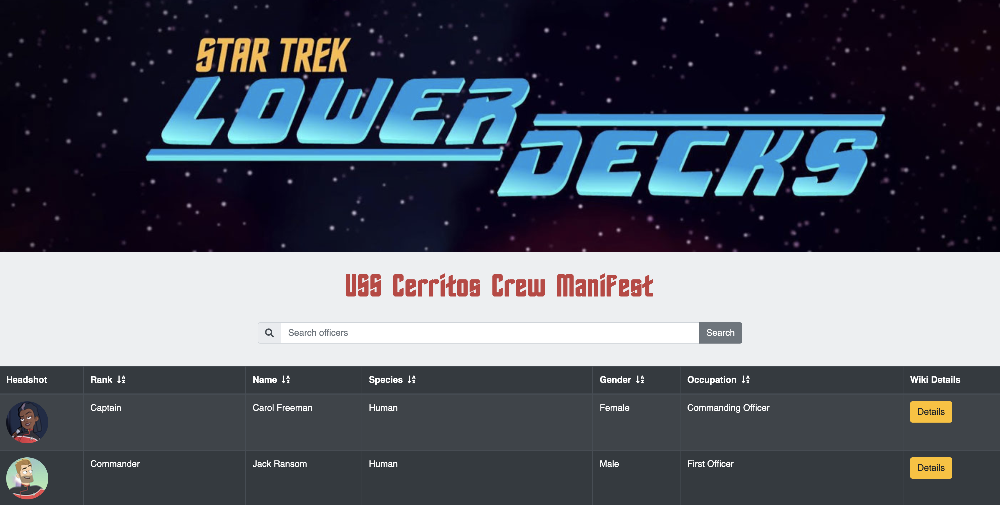

# USS Cerritos Crew Manifest App
This project was bootstrapped with [Create React App](https://github.com/facebook/create-react-app).

  
  ## Table of Contents
  1. [Project Description](#description)
  2. [Installation](#install)
  3. [Usage](#usage)
  4. [License](#license)
  5. [Contributors](#contributors)

  
  ## Project Description
  Users can browse the named officers of USS Cerritos of the CBS Star Trek Lower Decks animated show.
  

  ## Installation
  Click on the following link and the application will run.
  https://employee-directory-jmj.herokuapp.com/
  

  ## Usage
  Sort the table by ascending order by pressing the icons in the header row next to the header title (eg: Rank, Name, etc).  
  
  [If I can get this working...]  Search for officers by name in the input box.
  

  ### License
  MIT
  

  ### Contributors
  Jonayah M. Jackson

  #### Screenshots
  

  #### Contact Me
  * Heroku App: https://employee-directory-jmj.herokuapp.com/
  * GitHub Profile: https://github.com/JonayahJ
  * Email Address: jonayah@thinkhalcyon.com
